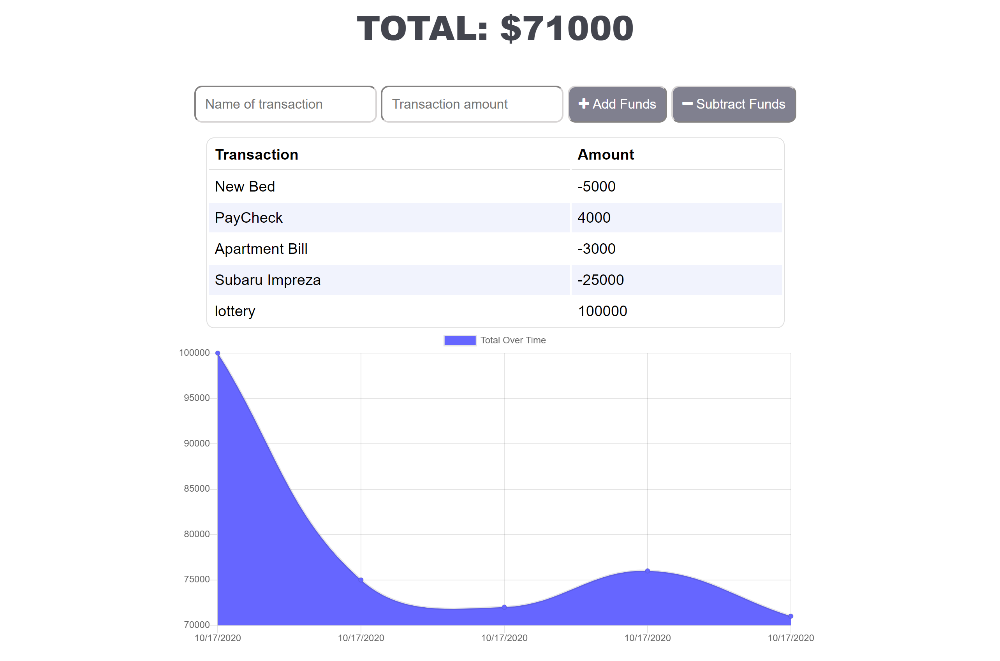

# Progressive-Budget
A Progressive Budget Tracker application to allow for offline access and functionality. The user will be able to add expenses and deposits to their budget with or without a connection. When entering transactions offline, they should populate the total when brought back online.

## Table of Contents
- [User Story](#user-story)
- [Deployment](#deployment)
- [Contributing](#contributing)

## User Story
```
AS AN avid traveller
I WANT to be able to track my withdrawals and deposits with or without a data/internet connection
SO THAT my account balance is accurate when I am traveling
```

## Deployment
https://progressive-budget-easy-app.herokuapp.com/



## Contributing
#### Erika Beasley
---------------

[<br /><sub><b>GitHub</b></sub>](https://github.com/erikabeasley)<br />